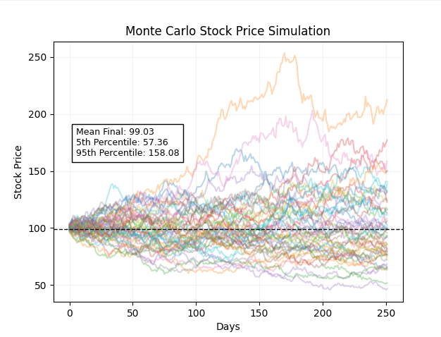
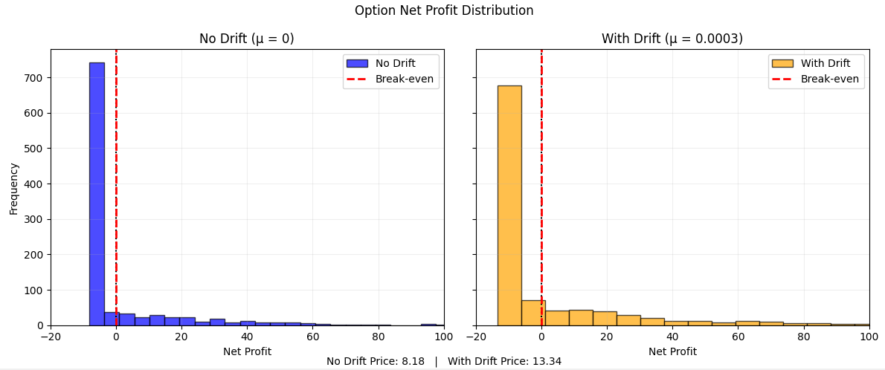
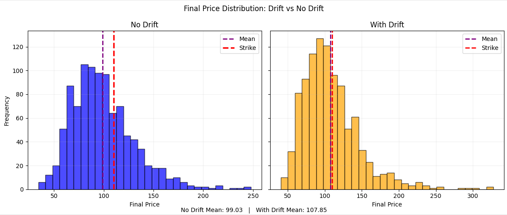

# Quant Finance & Physics Portfolio

A collection of Python projects applying stochastic modelling 
and Monte Carlo methods to quantitative finance problems.

---

## Project 1: Stochastic Asset Modelling

Geometric Brownian Motion (GBM) is the mathematical foundation 
of modern quantitative finance. It models asset prices as a 
continuous random walk with constant drift and volatility — the 
same stochastic process that underpins the Black-Scholes framework.

### Volatility Regime Comparison
Implements GBM from first principles using the SDE dS = μS dt + σS dW, 
simulating 1,000-day price trajectories across different volatility 
regimes to demonstrate how standard deviation governs the distribution 
of possible asset outcomes.

**Key features:** comparative volatility analysis | NumPy random 
walks | Matplotlib visualisation with statistical mean markers

### Exact GBM with Options Pricing
Rebuilds GBM using the exact log-normal formula, simulating 10,000 
price paths over 252 trading days. Prices a European call option 
via Monte Carlo and verifies against the Black-Scholes analytical 
solution.

**Key features:** exact GBM log-normal simulation | Monte Carlo 
option pricing | Black-Scholes verification | risk-neutral discounting

---

## Project 2: Monte Carlo Options Pricing

Extends the GBM framework to price European call options from first 
principles. Simulates 1,000 price paths over 252 trading days, 
computing call option value as the mean payoff across all paths.

Compares pricing under zero drift (μ = 0) vs positive drift 
(μ = 0.0003), demonstrating how expected return shifts the final 
price distribution rightward — increasing in-the-money paths and 
raising the expected payoff. A fundamental concept in derivatives 
pricing.

**Key features:** call option pricing | drift analysis | profit 
distribution visualisation | percentile risk metrics

*Results vary between runs by design — stochastic behaviour 
is the point.*

---

## Project 3: Monte Carlo Convergence Analysis

Demonstrates the convergence of Monte Carlo option pricing toward the 
Black-Scholes analytical solution as the number of simulation paths increases.

Simulates a European call option across path counts from 100 to 10,000, 
plotting the MC price against the closed-form Black-Scholes price to 
visualise the law of large numbers in action.

**Key features:** convergence analysis | Black-Scholes verification | 
law of large numbers | exact GBM simulation.

