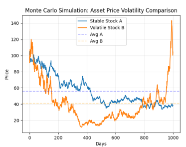

# Quant Finance & Physics Portfolio

A collection of Python projects applying stochastic modelling 
and Monte Carlo methods to quantitative finance problems.

---

## Project 1: Stochastic Asset Modelling

Geometric Brownian Motion (GBM) is the mathematical foundation 
of modern quantitative finance. It models asset prices as a 
continuous random walk with constant drift and volatility — the 
same stochastic process that underpins the Black-Scholes framework. 

This project implements GBM from first principles using the Stochastic Differential Equation (SDE) 
dS = μS dt + σS dW, simulating 1,000-day price trajectories across 
different volatility regimes to demonstrate how standard deviation 
governs the distribution of possible asset outcomes.

**Key features:** comparative volatility analysis | NumPy random 
walks | Matplotlib visualisation with statistical mean markers

---

## Project 2: Monte Carlo Options Pricing

Extends the GBM framework to price European call options from first 
principles. Simulates 1,000 price paths over 252 trading days, 
computing call option value as the mean payoff across all paths.

Compares pricing under zero drift (μ = 0) vs positive drift 
(μ = 0.0003), demonstrating how expected return shifts the final 
price distribution rightward — increasing in-the-money paths and 
raising the expected payoff. A fundamental concept in derivatives 
pricing.

**Key features:** call option pricing | drift analysis | profit 
distribution visualisation | percentile risk metrics

---

*Results vary between runs by design — stochastic behaviour 
is the point.*
